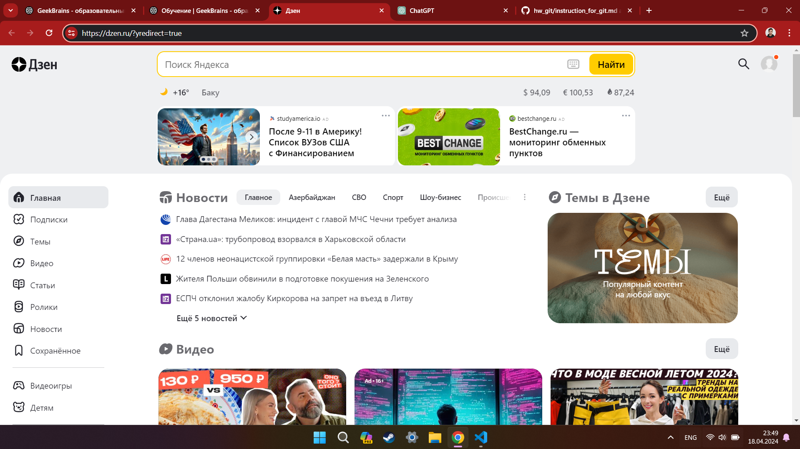
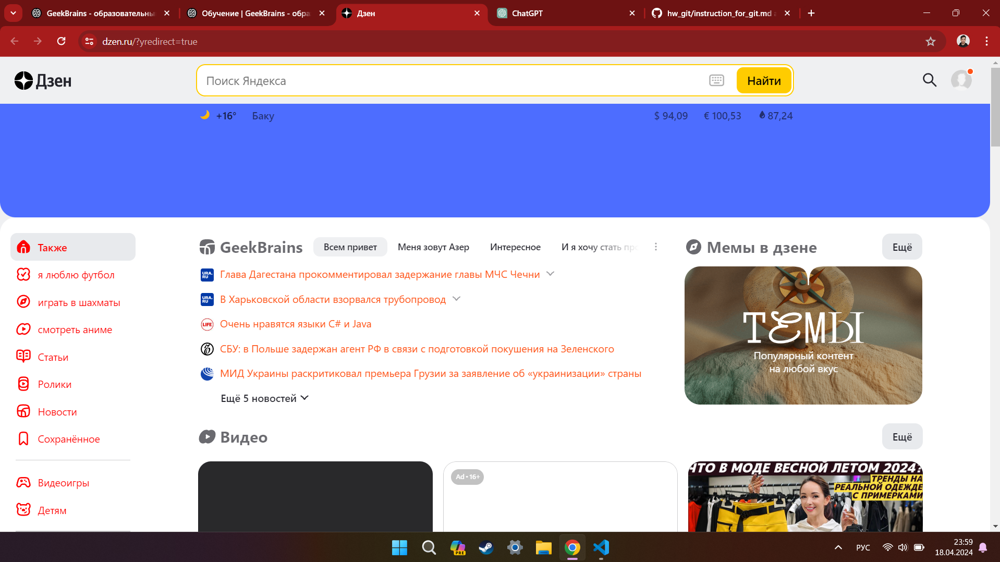
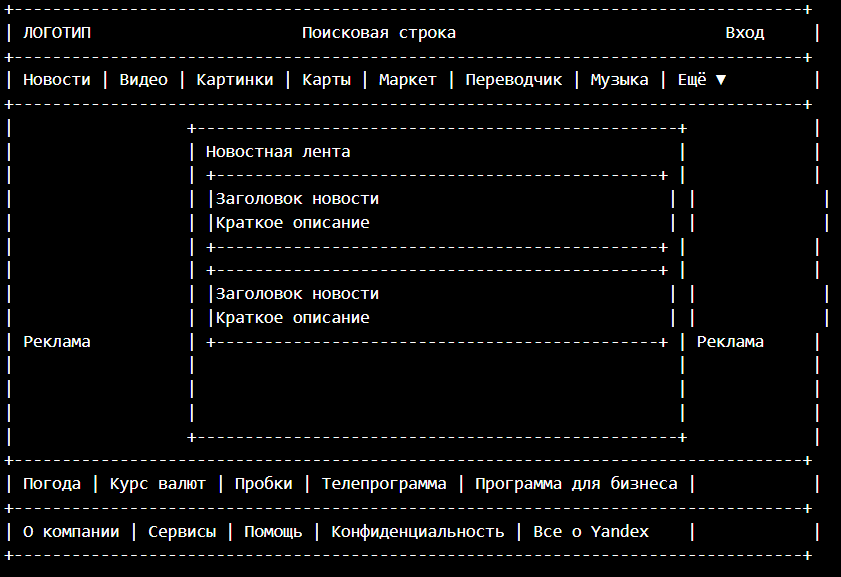

# Знакомство с веб-технологиями
## Урок 2. Семинар. Веб-технологии: вчера, сегодня, завтра
### Промежуточная аттестация

#### 1. Определите, на каком протоколе работает сайт.

- Сайт работает на протоколе **https**

#### 2. Проанализируйте структуру страницы сайта.

- **Шапка сайта**: Обычно содержит логотип компании, поисковую строку, ссылки на другие сервисы и разделы сайта.
- **Меню навигации**: Содержит ссылки на основные разделы и сервисы, такие как почта, карты, новости и другие.
- **Основное содержимое**: Может включать в себя блоки с новостями, рекламу, рекомендации и другие информационные блоки.
- **Подвал сайта**: Содержит дополнительные ссылки, контактную информацию, правила использования сайта и другую вспомогательную информацию.
- **Элементы управления**: Кнопки, поля ввода, фильтры и другие элементы, позволяющие взаимодействовать с сайтом.
- **Стили и скрипты**: Используются для оформления и функциональности сайта.
- **Метаданные**: Заголовок страницы, описание, ключевые слова и другие метаданные, влияющие на поисковую оптимизацию.
- **Ссылки и изображения**: Ссылки на другие страницы и изображения, используемые для визуального представления информации.

3. Внесите не менее 10 изменений на страницу с помощью инструмента разработчика и представьте скриншоты было/стало.

- *До:*

*После:*

4. Создайте прототип низкой детализации.

